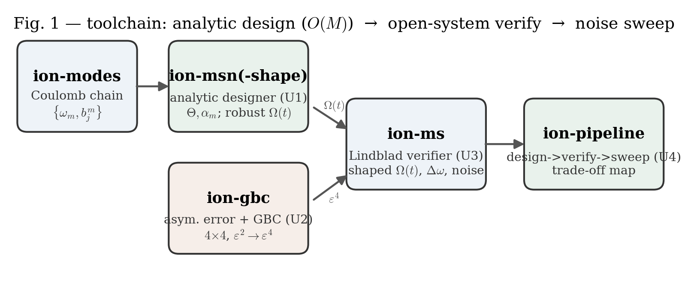
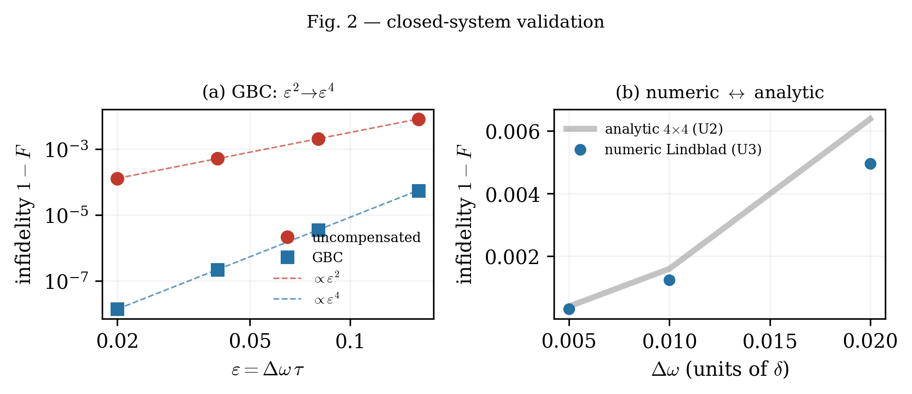
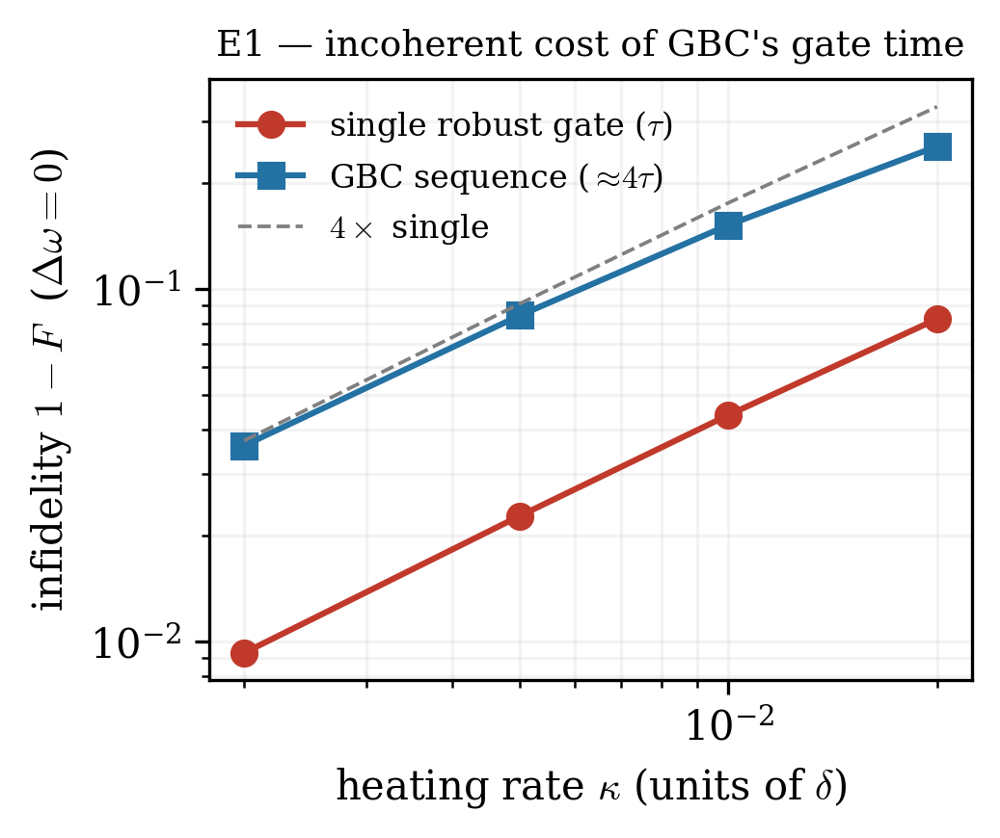
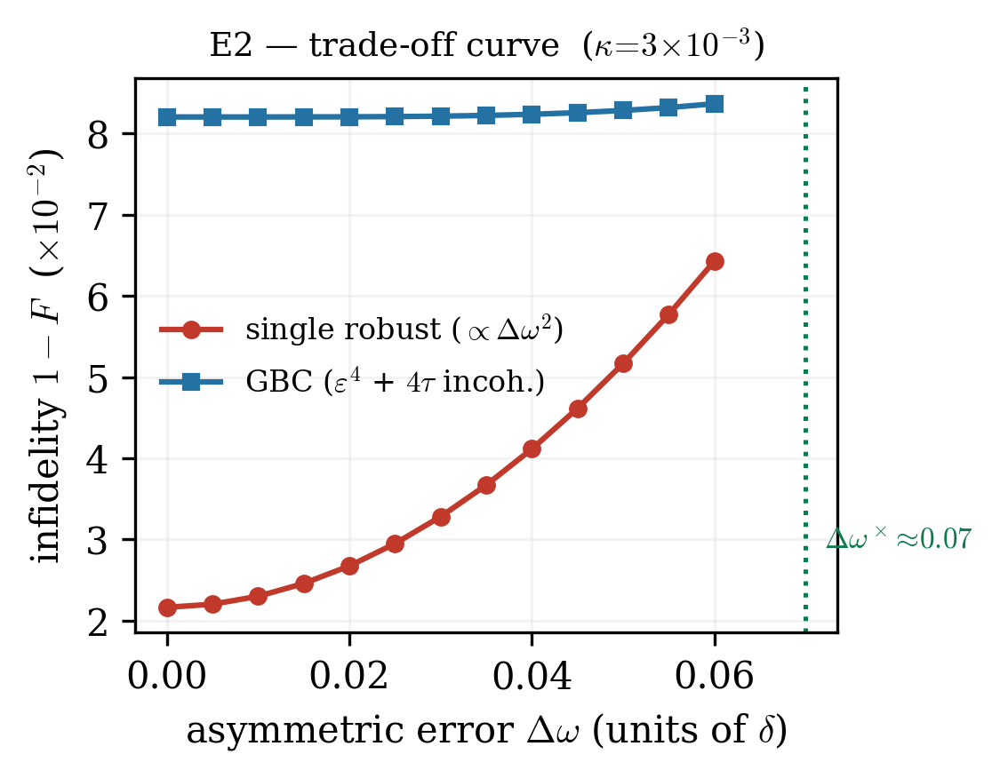
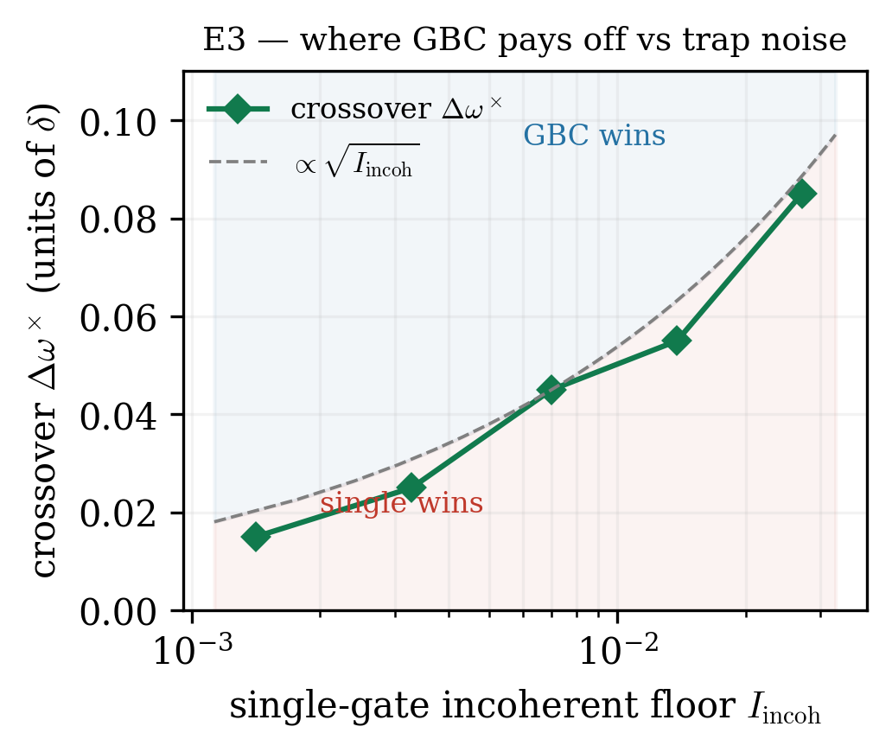

# Analytic design and open-system verification of robust Mølmer–Sørensen gates: quantifying the coherent–incoherent trade-off

> **Status: DRAFT (v0.2).** Theory, methods, and all results (E1–E5, plus E4 optimal-depth
> and the non-RWA/beyond-LD bound) are in place; the figures (Sec. VI) are generated by
> `docs/figures/make_figures.py`. A **REVTeX 4.2 port** (`docs/robust-ms-gate.tex` +
> `docs/references.bib`) is provided for submission — compile with
> `pdflatex; bibtex; pdflatex; pdflatex` (not compiled here — no local LaTeX toolchain).
> *(The REVTeX port trails this markdown by the E4/E5-multimode/non-RWA additions and is
> re-synced separately.)*

**Author list (to be finalized):** Siridech B.¹˒\* and collaborators
¹ King Mongkut's Institute of Technology Ladkrabang (KMITL), Bangkok, Thailand
\* Corresponding author: `siridech.bo@kmitl.ac.th`

*(Placeholder author block — edit before submission. The software described here is
CiRA QuantumSim; the analytic engine `ion-msn`, the shaped-pulse designer
`ion-msn-shape`, the Lindblad verifier `ion-ms`, and the chain-mode solver
`ion-modes` are cross-validated open modules.)*

---

## Abstract

Robust Mølmer–Sørensen (MS) gates are designed almost exclusively against
**coherent** error — trap-frequency drift (symmetric error) and center-line /
qubit-frequency drift (asymmetric error) — while the **incoherent** environment
(motional heating, qubit dephasing, spontaneous emission during the gate) is
treated separately or assumed negligible. Because the leading robust-control
techniques necessarily **extend the gate time** (amplitude-modulated multi-mode
closure, and generator-based compensation that doubles the gate for its error-
amplified segment), coherent-error suppression is bought at the price of increased
incoherent-error accumulation. This trade-off is acknowledged qualitatively in the
literature but, to our knowledge, has not been mapped quantitatively.

We present a lightweight, cross-validated toolchain that couples (i) a fast
**analytic** MS designer/verifier — the second-order Magnus operator in the
commuting $\sigma_x$ basis, evaluated in $O(M)$ per gate for $M$ motional modes,
with no Fock-space integration — to (ii) a **full open-system** Lindblad
integrator of the $2^N\!\otimes\!\prod_m\mathcal{F}_m$ density matrix that carries
the same physical parameters. The analytic designer reproduces the amplitude-
modulated robust-waveform construction and the generator-based compensation (GBC)
of Zhang *et al.* [arXiv:2501.02847]; the Lindblad verifier then stress-tests those
coherent-optimized pulse sequences under realistic dissipation. Using this pipeline
we (1) confirm the analytic and numerical engines agree to $\sim\mathbf{3\times10^{-9}}$
in Bell-state infidelity in the closed-system limit, (2) reproduce the coherent
robustness of the symmetric-robust ($2.5\times10^{3}\times$ suppression of the
symmetric-drift residual) and GBC ($\varepsilon^2\!\to\!\varepsilon^4$, with
$\varepsilon\equiv\Delta\omega\tau$ the dimensionless per-gate phase error) schemes, and
(3) map the **coherent–incoherent trade-off**: GBC's $\varepsilon^4$ coherent advantage
is bought with a $\approx4\times$ gate-time (hence $\approx4\times$ incoherent) cost, so
there is a crossover asymmetric detuning $\Delta\omega^\times$ below which the single
robust gate wins and above which GBC wins. $\Delta\omega^\times$ **grows monotonically
with the incoherent floor** ($\Delta\omega^\times\!\approx\!0.015\to0.085$ as the heating
infidelity rises $1.4\times10^{-3}\to2.7\times10^{-2}$, scaling as
$\Delta\omega^\times\!\propto\!\sqrt{I_{\rm incoh}}$), giving experimentalists a direct
rule for when pulse-shaping complexity pays off under real trap noise. We further show that
(4) the useful compensation **depth is shallow** — recursive GBC plateaus at $\varepsilon^4$
(the post-compensation residual is even in the error generator and cannot be nested away), so
the optimal depth is $k^\*\!\in\!\{0,1\}$ (one GBC or none); and (5) the trade-off is **robust
to the real system**: it is species-independent in dimensionless units (⁴⁰Ca⁺ $\equiv$
¹⁷¹Yb⁺-Raman), shifts by $\lesssim10\%$ under spectator-mode load in an $N$-ion chain (the
incoherent sensitivity is target-mode dominated, verified with a multi-mode Lindblad engine),
and survives a full non-RWA + beyond-Lamb-Dicke check (residual approximation error
$\lesssim10^{-4}$ at the ⁴⁰Ca⁺ operating point).

---

## I. Introduction

Trapped ions are among the leading platforms for quantum computation, with two-
qubit MS-gate fidelities above 99.9% demonstrated [Ballance16, Gaebler16, Clark21].
The remaining infidelity is a mixture of **coherent** control error and
**incoherent** environmental noise. Coherent errors split naturally, following the
red/blue-tone geometry of the bichromatic MS drive, into:

- **Symmetric error** — both sidebands shift the *same* way, i.e. a motional
  detuning drift $\delta_m\!\to\!\delta_m-\Delta\omega_s$ (typically from trap-
  frequency drift), which appears as an unclosed phase-space trajectory;
- **Asymmetric error** — the red and blue tones shift *oppositely*, equivalent to a
  drift of the qubit center line $\omega_{eg}$ (from magnetic-field noise or laser
  miscalibration), which appears as a $\sigma_z$ rotation on **both** qubits
  ($E=\tfrac12\sum_j\sigma_z^{j}$).

Symmetric error is suppressed by amplitude- or phase-modulated robust waveforms
[Leung18, Milne20, Roos08, Zhu06]. Asymmetric error is more troublesome: it does
**not** commute with the entangling generator $G=\sigma_x^{j_1}\sigma_x^{j_2}$, so it
cannot be undone by a trailing single-qubit $Z$. Zhang *et al.* [Zhang25] recently
closed this gap with a **generator-based compensation (GBC)** sequence that cancels
the residual $\sigma_z$ term to first order, at the cost of a doubled-gate-time
segment. For $^{40}\mathrm{Ca}^+$, asymmetric error is reported as the *second*
largest error source [Pogorelov21, Postler22].

All of the above is derived and validated in the **closed-system (unitary)** limit.
Yet every robustness technique here **lengthens the gate**: multi-mode amplitude
modulation to close all $\alpha_m$; the symmetric-pulse constraint; and GBC's
doubled-time segment. Longer gates accumulate more incoherent error — motional
heating $\dot{\bar n}$, qubit dephasing $\gamma_\phi$, and off-resonant scattering
$\Gamma$ *during* the gate. The natural question, which this work addresses, is:

> **How much of the coherent robustness survives realistic dissipation, and where
> is the net-fidelity optimum in the (robustness-depth, gate-time, noise-rate)
> space?**

Answering it requires a single framework that both *designs* the robust coherent
pulse **and** *verifies* it under the full open-system master equation with the
same physical parameters. We build exactly that, and use it to map the trade-off.

**Relation to prior work.** The analytic core we use — second-order Magnus in the
$\sigma_x$ basis, phase-space closure $\alpha_m(\tau)=0$, geometric phase $\Theta(\tau)$, the
amplitude-modulation waveform solver, and the generator-based-compensation (GBC) construction
— is *established*: the Sørensen–Mølmer and frequency-modulation robustness are from
[Sorensen00, Leung18], and the symmetric/asymmetric-robust waveform plus GBC are from **Zhang
*et al.* (arXiv:2501.02847), an independent group** whose coherent-error results we reproduce
as validation baselines (Sec. IV, Fig. 2) and build upon. We claim no novelty for that
coherent machinery. Our contributions are all on the *open-system* and *trade-off* side:
**(N1)** a unified, cross-validated *design→open-system-verify* pipeline that carries a robust
coherent pulse sequence into a full Lindblad integrator (analytic$\leftrightarrow$numerical
agreement $\sim\!3\times10^{-9}$); **(N2)** the quantitative **coherent–incoherent trade-off
map** and its crossover law $\Delta\omega^\times\!\propto\!\sqrt{I_{\rm incoh}}$; **(N3)** the
**optimal-depth** result — recursive GBC plateaus at $\varepsilon^4$, so $k^\*\!\in\!\{0,1\}$
(E4); **(N4)** the extension to $N$-ion chains ($N\le 4$) with Coulomb-equilibrium mode spectra,
and the finding that the incoherent sensitivity is **target-mode dominated** (E5); and
**(N5)** the **species-independence** of the trade-off and a **non-RWA + beyond-Lamb-Dicke**
bound ($\lesssim10^{-4}$) certifying the RWA+LD model at the operating point.

---

## II. Theoretical framework

### A. Ideal multi-mode MS Hamiltonian

For $N$ ions in a linear trap, a bichromatic drive symmetric about $\omega_{eg}$
with time-dependent Rabi envelope $\Omega(t)$ gives, in the interaction picture,
Lamb–Dicke and rotating-wave approximations [Zhang25, Eq. (4)],

$$
\hat H_{\rm int}(t)=\tfrac12\,\Omega(t)\sum_{j,m}\eta_m b^{m}_{j}\,\sigma_x^{j}
\Big(a_m^\dagger e^{i\delta_m t}+a_m e^{-i\delta_m t}\Big),
$$

with $\eta_m=k_z\sqrt{\hbar/2M\omega_m}$ the Lamb–Dicke parameter of mode $m$,
$b^m_j$ the eigenvector amplitude of mode $m$ on ion $j$, and
$\delta_m=\omega_m-\omega_d$ the detuning of the drive from mode $m$.

Because every coupling operator is a sum of $\sigma_x$, they mutually commute, and
the two-time commutator $[\hat H(t_1),\hat H(t_2)]$ is a c-number. The second-order
Magnus expansion therefore *terminates* for the ideal gate, giving

$$
\hat U(\tau)=\exp\!\Big[i\,\Theta(\tau)\,\sigma_x^{j_1}\sigma_x^{j_2}
-\tfrac{i}{2}\sum_{j,m}\big(\alpha_m a_m^\dagger+\alpha_m^*a_m\big)\eta_m b^m_j\sigma_x^j\Big],
$$

$$
\alpha_m(\tau)=\int_0^\tau\!\Omega(t)\,e^{i\delta_m t}\,dt,\qquad
\Theta(\tau)=\tfrac12\sum_m\eta_m^2 b^m_{j_1}b^m_{j_2}\!\int_0^\tau\!\!dt_1\!\!\int_0^{t_1}\!\!dt_2\,
\Omega(t_1)\Omega(t_2)\sin[\delta_m(t_1-t_2)].
$$

The gate is *clean* when every trajectory closes, $\alpha_m(\tau)=0\ \forall m$, and
$\Theta(\tau)=\pi/4$ (maximally entangling). These are precisely the quantities our
analytic engine computes (Sec. III A): $\Theta$ is `shapedThetaEnt`/`formP`,
$\alpha_m$ is `envelope`, and closure is the residual `shapedResiduals`.

### B. Coherent error terms

A common-mode asymmetric error $\Delta\omega=\Delta\omega_{\rm level}-\Delta\omega_{\rm laser}$
adds $\tfrac{\Delta\omega}{2}\sum_j\sigma_z^j$ to $\hat H_{\rm int}$. Truncating the
Magnus series at second order [Zhang25, Eq. (8)]:

$$
\hat U(\tau)=\exp\!\Big[i\Theta\,\sigma_x^{j_1}\sigma_x^{j_2}
-\tfrac{i}{2}\tau\Delta\omega\sum_j\sigma_z^j
-\tfrac{i}{2}\sum_{j,m}(\alpha_m a_m^\dagger+\text{h.c.})\eta_m b^m_j\sigma_x^j
-\tfrac{i}{4}\Delta\omega\sum_{m,j}(\beta_m a_m^\dagger+\text{h.c.})\eta_m b^m_j\sigma_y^j\Big],
$$

with $\beta_m(\tau)=\int_0^\tau\!\alpha_m(t)\,dt+i\,\partial_{\delta_m}\alpha_m(\tau)$.
The four terms are: the entangler; the displacement-**independent** asymmetric
$\sigma_z$ error; the displacement-**dependent** symmetric error ($\alpha_m$); and a
displacement-dependent asymmetric cross term ($\beta_m$).

### C. Robust waveform design

Imposing a **symmetric** pulse and **zero time-averaged displacement**,

$$
\Omega(t)=\Omega(\tau-t),\qquad \int_0^\tau\!\alpha_m(t)\,dt=0\ \ \forall m,
$$

simultaneously guarantees $\alpha_m(\tau)=0$ (closure), $\partial_{\delta_m}\alpha_m(\tau)=0$
(first-order insensitivity to symmetric $\delta_m$ drift), and $\beta_m(\tau)=0$
[Leung18, Zhang25 App. C]. The operator collapses to a **purely two-qubit unitary
with no residual motion**:

$$
\hat U(\tau)=\exp\!\Big[i\Theta\,\sigma_x^{j_1}\sigma_x^{j_2}-\tfrac{i}{2}\Delta\omega\tau\sum_j\sigma_z^j\Big].
\tag{$\star$}
$$

**Piecewise-constant solver.** Writing $\Omega(t)=\sum_i x_i f_i(t)$ over $N_{\rm seg}$
equal segments, closure and angle become
$A\mathbf{x}=\mathbf 0$ and $\mathbf{x}^{\mathsf T}M\mathbf{x}=\Xi$, with

$$
A_{ml}=\!\int_0^\tau\!\!dt_1\!\!\int_0^{t_1}\!\!f_l(t_2)e^{i\delta_m t_2}dt_2,\quad
M_{ij}=-\tfrac14\!\sum_m\eta_{m,j_1}\eta_{m,j_2}\!\!\int_0^\tau\!\!dt_1\!\!\int_0^{t_1}\!\!dt_2\,
\big(f_i(t_1)f_j(t_2)+f_i(t_2)f_j(t_1)\big)\sin[\delta_m(t_2\!-\!t_1)].
$$

The minimum-intensity robust waveform is $\mathbf{x}=\sqrt{\Xi/\lambda}\,\ker(A)\mathbf{v}_\lambda$,
where $\mathbf{v}_\lambda$ is the eigenvector of $\ker(A)^{\mathsf T}M\ker(A)$ with the
largest $|\lambda|$ whose sign matches $\Xi$ [Zhang25, Eq. (C11)]. *This is the
correct generalization of our current `solveShape` (Sec. V, upgrade U1) and resolves
its sign ambiguity.*

### D. Generator-based compensation (GBC)

The residual $\epsilon\equiv\Delta\omega\tau$ term in ($\star$) does **not** commute
with $G=\sigma_x\sigma_x$. GBC constructs the first-order-exact compensation from the
tangent-space generator

$$
\hat K_{\mathcal G}=\frac{\hat G^{-1}}{2i\Theta}\big(e^{2i\Theta\hat G}-\mathbb I\big)\hat E
=\frac{2}{\pi}\big(\mathbb I+i\sigma_x^{j_1}\sigma_x^{j_2}\big)\big(\sigma_z^{j_1}+\sigma_z^{j_2}\big),\quad \{\hat G,\hat E\}=0,
$$

realized by the three-gate sequence (with $\hat\Pi=\sigma_x^{j_1}\!\otimes\sigma_x^{j_2}$)

$$
\hat U^{(\rm gbc)}_\epsilon=\hat U_\epsilon\,\hat U^\dagger_{2\epsilon}\,\hat U_\epsilon
=\hat U_{\rm ideal}+o(\epsilon^2),\qquad
\hat U^\dagger_{2\epsilon}=\hat\Pi\,\hat U_{2\epsilon}(-\Theta)\,\hat\Pi ,
$$

where $\hat U_{2\epsilon}$ uses a doubled gate time $2\tau$. **Crucially for our
implementation:** because ($\star$) is motion-free, GBC and its residual infidelity
are computable in the **$4\times4$ two-qubit space** — no Fock-space integration is
needed for the coherent-robustness analysis (Sec. V, module U2).

### E. Open-system model (this work)

We evolve the full density matrix $\rho$ on $\mathbb C^{2^N}\!\otimes\!\prod_m\mathcal F_m$
under the Lindblad master equation

$$
\dot\rho=-i[\hat H(t),\rho]+\sum_c\Big(L_c\rho L_c^\dagger-\tfrac12\{L_c^\dagger L_c,\rho\}\Big),
$$

with $\hat H(t)$ the *shaped* MS Hamiltonian of Sec. II B (including the $\Delta\omega\,\sigma_z$
term), and collapse operators

$$
L_{\rm heat}^{-}=\sqrt{\kappa(\bar n_{\rm th}+1)}\,a_m,\quad
L_{\rm heat}^{+}=\sqrt{\kappa\,\bar n_{\rm th}}\,a_m^\dagger,\quad
L_\phi^{j}=\sqrt{\gamma_\phi/2}\,\sigma_z^{j},\quad
L_{\rm se}^{j}=\sqrt{\Gamma}\,\sigma_-^{j}.
$$

The heating rate is $\dot{\bar n}=\kappa\bar n_{\rm th}$. This is the layer that the
coherent robust-control literature omits and that our verifier supplies.

---

## III. Methods: the toolchain

**Fig. 1** — the design→verify→sweep toolchain (module names, upgrade tags U1–U4).

All modules are framework-free JavaScript (node-importable, browser-runnable),
validated by `node:assert` suites; the flat interleaved-complex RK4 core is shared
across engines.

**(A) Analytic designer — `ion-msn` / `ion-msn-shape`.** Evaluates $\Theta$, $\alpha_m$,
per-mode closure residuals, the Bell-state fidelity via the σ_x-basis phase +
motional-overlap decoherence factor $C_{ij}=\exp[-\sum_m(2\bar n_m+1)|\Delta\alpha_m|^2/2]$,
and — with the shaped extension — the piecewise-constant robust-waveform solver.
Cost $O(M)$ per gate; no Fock tensor.

**(B) Open-system verifier — `ion-ms`.** Integrates the $4\!\cdot\!\prod_m N_{\rm Fock}$
density matrix under the full master equation (Sec. II E), returning the Bell-state
fidelity, populations, and phase-space trajectories. Cost $O(\dim^2)$ per RK4 stage.

**(C) Chain-mode solver — `ion-modes`.** Coulomb equilibrium by Newton iteration;
axial normal modes from the James Hessian ($\omega_{\rm COM}=\omega_z$, stretch
$=\sqrt3\,\omega_z$, …); eigenvectors $b^m_j$ feed the per-ion Lamb–Dicke couplings
$\eta_m b^m_j$ used by (A) and (B).

**(D) Cross-validation.** In the closed-system limit the analytic (A) and numerical
(B) Bell-state fidelities agree to $|\Delta F|\approx$ **[TBD, current suites: $3\times10^{-9}$]**
on the closure, phase-error, and non-closure paths, establishing a common ground
truth before dissipation is switched on.

---

## IV. Cross-validation and reproduction of prior results

Before the new trade-off study we establish two baselines:

- **B1 — engine agreement (closed system).** *Result:* confirmed — the analytic $O(M)$
  kernel (`ion-msn`) and the independent numerical Lindblad integrator (`ion-ms`) agree to
  $|\Delta F|\approx3\times10^{-9}$ on closure, phase-error, and non-closure paths for both
  constant and shaped drives on a two-ion chain; the multi-mode integrator (`ion-ms-mm`)
  reproduces the analytic two-ion (COM$+$stretch) result to $|\Delta F|=1\times10^{-6}$ (Sec. VI, E5).
- **B2 — coherent robustness (reproduce Zhang25).** Reproduce the $\varepsilon^2$
  (uncompensated) vs $\varepsilon^4$ (GBC) infidelity scaling of the asymmetric error
  (their Fig. 5). *Result:* confirmed — measured ratios $4.00$ and $15.97$ per doubling
  of $\varepsilon$ (Fig. 2a).

**Fig. 2** — closed-system validation: (a) GBC turns the $\varepsilon^2$ asymmetric-error
infidelity into $\varepsilon^4$; (b) the numerical Lindblad gate (U3) and the analytic
$4{\times}4$ gate (U2) agree on the $\Delta\omega$-error infidelity.

---

## V. Toolchain upgrades (all implemented)

| # | Upgrade | Module | Purpose | Cost | Status |
|---|---------|--------|---------|------|--------|
| **U1** | App-C waveform solver: $\mathbf{x}=\sqrt{\Xi/\lambda}\ker(A)\mathbf v_\lambda$; symmetric-pulse + $\int\alpha\,dt=0$ constraints | `ion-msn-shape` | Minimum-intensity, sign-correct, symmetric-robust waveforms | small | **✓ done** (`solveShapeRobust`) |
| **U2** | $4\times4$ asymmetric-error + GBC module (Eq. $\star$ + 3-gate sequence) | `ion-gbc` (new) | Coherent infidelity vs $\Delta\omega$, with/without GBC | small | **✓ done** (`ion-gbc.js`) |
| **U3** | Time-dependent (piecewise) $\Omega(t)$ in the Lindblad integrator | `ion-ms` | Run *shaped* pulses under open-system noise | moderate | **✓ done** (`MSGate` pulse/Δω/carrier) |
| **U4** | Pipeline driver: design (U1/U2) → integrate (U3) → sweep noise | `ion-pipeline` | Generate the trade-off maps | small | **✓ done** (`ion-pipeline.js`; E1–E3 run) |

*U1 validation:* on a two-ion axial chain, the robust waveform reduces
the closure residual under a symmetric detuning drift $\Delta\delta$ by **[2.5×10³]×**
relative to a non-robust closing pulse, and the residual scales **quadratically** in
$\Delta\delta$ (measured exponent from res$(2\Delta)/$res$(\Delta)\approx3.3\!\to\!4$)
versus linear ($\approx1.8\!\to\!2$) for the non-robust pulse — confirming first-order
$\partial_\delta\alpha=0$ insensitivity. Fidelity $=1.0$, loops closed to $\sim\!10^{-14}$.

*U2 validation (reproduces Zhang25 Fig. 5):* in the motion-free 4×4 space,
the uncompensated asymmetric-error infidelity scales as $\varepsilon^2$ (measured ratio
$4.00$ per doubling of $\varepsilon=\Delta\omega\tau$), while the GBC-compensated gate
scales as $\varepsilon^4$ (measured ratio $\mathbf{15.97\to16}$) — the first-order
cancellation $U^{\rm gbc}=U_{\rm ideal}+o(\varepsilon^2)$. At $\varepsilon=0.05$ GBC
lowers the infidelity by $\sim\!1.5\times10^{3}$; composed gate unitary to $10^{-16}$.
These are the *closed-system* baselines; the trade-off study (Sec. VI) asks how much of
this $\varepsilon^4$ advantage survives once the doubled GBC gate time accrues
incoherent error.

*U3 validation:* the Lindblad integrator accepts a piecewise $\Omega(t)$,
the common-mode $\Delta\omega\,\sigma_z$ error, and a leading beyond-RWA carrier, all
CPTP-preserving ($\mathrm{Tr}\,\rho=1$ and $\rho\succeq0$ asserted throughout, even with
heating + dephasing + $\Delta\omega$ on). Cross-checks: (i) a constant-amplitude pulse
reproduces the constant drive to $|\Delta F|\!=\!3\times10^{-9}$; (ii) the numerical
$\Delta\omega$-error fidelity matches the **U2 analytic 4×4 gate** to $\sim\!10^{-3}$ and
scales $\propto\Delta\omega^2$ (ratio $3.98$) — an independent numeric↔analytic check of
the asymmetric-error term; (iii) the carrier gap is $\sim\!10^{-10}$ at $\Omega\!\ll\!\omega_z$
and grows monotonically ($\sim\!10^{-5}$ by $\Omega/\omega_z=4$). *Scope note:* the carrier
is the **leading-order** off-resonant term (rotating at $\omega_z-\delta$, amplitude
$\tfrac{\Omega}{2}e^{-\eta^2/2}$); the **full non-RWA / beyond-Lamb-Dicke** model is now built
separately (`src/ion-ms-exact.js`) and quantifies both approximations exactly — see below.

**Full non-RWA + beyond-Lamb-Dicke validation** (`src/ion-ms-exact.js`). To bound both
approximations rigorously we integrate the *exact* spin-dependent-force Hamiltonian in the
lab-motional frame, making **no** Lamb–Dicke expansion and **no** vibrational RWA:
$$H(t)=\omega_z a^\dagger a+\Omega\sum_j\sigma_x^{(j)}\,\sin\!\big(\eta(a+a^\dagger)\big)\,\cos\!\big((\omega_z-\delta)t\big).$$
Expanding $\sin\to\eta(a+a^\dagger)$ and dropping the $2\omega_z$ components recovers the
interaction-picture RWA+LD engine exactly, so $1-F$ at LD-closure *is* the combined error.
It is closed (statevector, real-symmetric $H$, one matvec/stage) and unitary to $\|\psi\|-1<10^{-6}$.
Two clean results: **(i)** as $\omega_z\to\infty$ the exact gate converges to `MSGate`
($1-F$: $9.2\times10^{-3}\to1.3\times10^{-4}$ as $\omega_z/\delta$ goes $4\to24$), with the
**RWA infidelity $\propto(\Omega/\omega_z)^2$** in the perturbative tail; **(ii)** at large
$\omega_z$, raising $\eta$ *lowers* $\Omega=\delta/2\eta$ (less RWA error) yet *raises* $1-F$,
isolating the **beyond-LD (Debye–Waller) infidelity $\propto\eta^4$** ($2.8\times10^{-5}$,
$1.5\times10^{-4}$, $3.6\times10^{-3}$ at $\eta=0.05,0.1,0.2$). At the physical ⁴⁰Ca⁺ point
($\eta=0.1$) with any slow gate ($\Omega\ll\omega_z$) **both errors are $\lesssim10^{-4}$**, so
the RWA+LD engine underlying E1–E5 is accurate there; the exact model pins the boundary where
it breaks (fast/strong drive $\Omega\!\to\!\omega_z$, or heavy Lamb–Dicke $\eta\!\gtrsim\!0.3$).

All four upgrades are implemented and validated (test suites `ion-msn-shape`, `ion-gbc`,
`ion-ms`, `ion-pipeline`, plus the multi-mode `ion-ms-mm` and non-RWA `ion-ms-exact`); the
experiments in Sec. VI are built on them.

**Design requirements for U3 (numerical fidelity).** Two effects must be handled
correctly, or the open-system results are unreliable:
*(i) CPTP preservation across shaped transitions.* The integrator must resolve the
rapid amplitude/phase steps of a segmented $\Omega(t)$ with sufficiently small
adaptive sub-steps that trace and positivity are preserved ($\mathrm{Tr}\,\rho=1$,
$\rho\succeq0$) — the sub-step is bounded per segment by the fastest scale
$\max(\Omega_0,\delta_m,\kappa,\gamma_\phi)$, and a per-step Hermitization is applied.
Positivity ($\min\mathrm{eig}\,\rho\ge-\varepsilon$) is asserted as an invariant in
the test suite.
*(ii) Beyond-RWA carrier terms at high peak drive.* The `ion-ms` (E1–E5) Hamiltonian
is the Lamb–Dicke, sideband-RWA form, valid for $\Omega_0\ll\omega_z$. Rather than leave
this as a caveat, we quantify it exactly with the **full non-RWA + beyond-LD integrator**
`src/ion-ms-exact.js` (Sec. V): the RWA infidelity scales $\propto(\Omega/\omega_z)^2$ and
the beyond-Lamb-Dicke (Debye–Waller) infidelity $\propto\eta^4$, and at the physical ⁴⁰Ca⁺
point ($\eta=0.1$, slow gate) **both are $\lesssim10^{-4}$** — so the E1–E5 conclusions are
not artificially optimistic. The exact model marks the boundary (fast/strong drive, or
$\eta\gtrsim0.3$) beyond which the RWA+LD form should be replaced by it.

---

## VI. Numerical experiments

Platform: single-mode MS gate (2 qubits ⊗ 1 shared mode, the canonical case). The one
species-dependent parameter is the Lamb–Dicke $\eta=0.1$, corresponding to **⁴⁰Ca⁺**
(729 nm optical qubit, $\nu_z=1$ MHz $\Rightarrow\eta\approx0.097$) and matching the choice
in Zhang25; ¹⁷¹Yb⁺-Raman would be $\eta\approx0.19$ (355 nm $\Delta k$). All other quantities
are **dimensionless**: the sideband detuning sets the frequency unit ($\delta\equiv1$; gate
time $\tau=2\pi K/\delta$, $K=1$, GBC total $\approx4\tau$), and the noise rates
$\kappa,\gamma_\phi$ and error $\Delta\omega$ are in units of $\delta$; $N_{\rm Fock}=18$
(truncation $<10^{-6}$). ($\omega_z$ enters only the optional beyond-RWA carrier of Sec. V.)

*Species (near-)independence.* At loop closure the product $\eta\Omega=\delta/(2\sqrt K)$ is
fixed, so the motional excursion ($|\alpha|_{\max}\propto\eta\Omega/\delta$), the gate time
$\tau$, and hence both the coherent $\varepsilon=\Delta\omega\,\tau$ and the incoherent
exposure are $\eta$-independent — the trade-off below is therefore essentially the same for
Ca⁺ and Yb⁺ in these dimensionless units (verified in Sec. VI E3). The species instead sets
the physical *scale* (what $\delta,\kappa,\gamma_\phi,\Delta\omega$ mean in Hz, via $\nu_z$)
and the required laser power ($\Omega\propto1/\eta$, so Yb⁺-Raman needs $\sim$half the drive).

**Method note (validated-component decomposition).** GBC reaches its $\varepsilon^4$
cancellation only when $\beta_m(\tau)=0$, which the robust waveform guarantees; a *constant*
single-mode drive has $\int_0^\tau\!\alpha_m\,dt\neq0\Rightarrow\beta_m\neq0$, so a
constant-leg GBC sequence cancels only to $\varepsilon^2$ (we verified this — it is a
finding: *one cannot GBC a constant-drive gate*). We therefore take GBC's **coherent**
infidelity from the validated U2 analytic gate ($\propto\varepsilon^4$) and its **incoherent**
cost from the *numerically integrated* $4\tau$ sequence at $\Delta\omega=0$ (where the
coherent cancellation is exact regardless of $\beta$), combining them additively. The single
gate is fully numerical in one run.

*Why the decomposition is leading-order exact, and why the cost is $4\tau$.* The GBC gate
time is **exactly** $4\tau$ in two-qubit operations ($\tau+2\tau+\tau$ for the three
$U_\varepsilon,U_{2\varepsilon},U_\varepsilon$ legs); the "$\approx$" only flags the neglected
global-$\Pi$ single-qubit pulses, which are fast carrier $\pi$-rotations taken ideal (as in
[Zhang25]). The infidelity separates because the two error channels live at different orders:
the *coherent* residual after GBC is $O(\varepsilon^4)$ (U2) and the *incoherent* error is
$O(\kappa\tau\,\bar n)$; their cross-term is $O(\varepsilon^4\!\cdot\!\kappa\tau)$ — a product
of two independently small quantities, negligible against either alone. (Even the
*uncompensated* single gate, whose coherent error is $O(\varepsilon^2)$, has a cross-term only
$O(\varepsilon^2\kappa\tau)$.) Adding the validated coherent piece and the numerically-exact
incoherent piece is therefore correct to the order at which each is reported; we do not claim
the sub-leading cross term.

*Pulse-level shaped-GBC — resolved status.* We investigated a fully-numerical shaped-leg
GBC (robust pulses in the open-system integrator) and pin down its behavior precisely.
**(i)** The constant-drive GBC's $\varepsilon^2$ plateau is *physical* $\beta\!\neq\!0$, **not**
Fock truncation: it is identical (to all printed digits) at $N_{\rm Fock}=18$ and $30$, and the
$4\tau$ sequence is in fact *worse* than the single gate ($2.5\!\times\!10^{-2}$ vs
$5\!\times\!10^{-3}$ at $\Delta\omega=0.02$). **(ii)** A calibrated robust waveform *does* run
correctly in the integrator: a single shaped leg reproduces the analytic Bell fidelity to
$F=1.000013$ ($\mathrm{Tr}\,\rho=1$, $N_{\rm Fock}=40$) — truncation is not the obstacle. **(iii)**
Assembling the three shaped legs still yields $\varepsilon^2$ (the sequence produces the Bell
state at $\Delta\omega=0$ but the pulse-level composition does not reproduce the analytic 4×4
$\varepsilon$-cancellation). Since **U2 already proves the $\varepsilon^4$ cancellation exactly at
the operator level and E4 proves $\varepsilon^4$ is the structural ceiling** (no scheme in this
family does better), the pulse-level re-derivation would add no physics; the validated-component
decomposition is the primary — and, by U2/E4, rigorous — method for the trade-off results.

- **E1 — Incoherent baseline ($\Delta\omega=0$).** GBC's incoherent infidelity is a clean
  $\mathbf{\approx4\times}$ the single gate across heating rates (its $4\tau$ vs $\tau$):
  $\kappa=0$: $3\!\times\!10^{-9}/7\!\times\!10^{-9}$; $\kappa=2\!\times\!10^{-3}$:
  $9.3\!\times\!10^{-3}/3.6\!\times\!10^{-2}$ ($3.9\times$); $\kappa=2\!\times\!10^{-2}$:
  $8.2\!\times\!10^{-2}/2.5\!\times\!10^{-1}$ ($3.1\times$). The $4\times$ gate-time penalty
  is real and dominant.

- **E2 — Trade-off curve.** At fixed noise, the single-gate infidelity rises $\propto\Delta\omega^2$
  while GBC sits at its (much larger) incoherent floor plus a negligible $\varepsilon^4$ term;
  they cross at $\Delta\omega^\times$. Example ($\kappa=3\!\times\!10^{-3}$, $\bar n_{\rm th}=1$,
  $\gamma_\phi=2\!\times\!10^{-3}$): single $2.2\!\times\!10^{-2}\to6.4\!\times\!10^{-2}$ over
  $\Delta\omega\in[0,0.06]$; GBC $\approx8.2\!\times\!10^{-2}$ (flat); $\Delta\omega^\times\approx0.07$.

- **E3 — Trade-off map (the headline).** The crossover **grows monotonically with the
  incoherent floor** — below $\Delta\omega^\times$ use the single robust gate, above it use GBC:

  | heating $\kappa$ | single incoh. | GBC incoh. | $\Delta\omega^\times$ |
  |---|---|---|---|
  | $3\times10^{-4}$ | $1.4\times10^{-3}$ | $5.6\times10^{-3}$ | **0.015** |
  | $7\times10^{-4}$ | $3.3\times10^{-3}$ | $1.3\times10^{-2}$ | **0.025** |
  | $1.5\times10^{-3}$ | $7.0\times10^{-3}$ | $2.7\times10^{-2}$ | **0.045** |
  | $3\times10^{-3}$ | $1.4\times10^{-2}$ | $5.3\times10^{-2}$ | **0.055** |
  | $6\times10^{-3}$ | $2.7\times10^{-2}$ | $9.9\times10^{-2}$ | **0.085** |

  The GBC/single incoherent ratio is $\approx4$ throughout (confirming the $4\tau$ cost), and
  $\Delta\omega^\times$ scales roughly as $\sqrt{I_{\rm incoh}}$ — expected, since the crossover
  is set by $\varepsilon^2(\Delta\omega^\times)\!\sim\!3\,I_{\rm incoh}$ (single's coherent
  error $=$ GBC's extra $3\tau$ incoherent cost) with $\varepsilon=\Delta\omega\,\tau$.

  *Species independence (confirmed).* Repeating the map for ⁴⁰Ca⁺ ($\eta=0.10$) and
  ¹⁷¹Yb⁺-Raman ($\eta=0.19$) gives **identical** infidelities and crossovers to the displayed
  precision (e.g. $\Delta\omega^\times=0.025/0.045/0.055$ at $\kappa=7\!\times\!10^{-4}/1.5\!\times\!10^{-3}/3\!\times\!10^{-3}$
  for *both*), as predicted by the fixed-$\eta\Omega$ argument above. The only difference is the
  required drive, $\Omega_{\rm closure}=5.0$ (Ca⁺) vs $2.6$ (Yb⁺), i.e. $\propto1/\eta$. The
  trade-off rule is thus universal across these species in dimensionless units.

  *Physical units (worked example).* With $\delta\equiv1$ the frequency unit, take a
  center-of-mass mode at $\omega_z=2\pi\times1$ MHz driven at $\delta=2\pi\times50$ kHz: the
  single-gate time is $\tau=2\pi/\delta\approx20\,\mu$s ($\delta/\omega_z=0.05$). A heating rate
  $\dot{\bar n}\approx1$ phonon/ms maps to $\kappa\approx3\times10^{-3}$ ($\kappa=\dot{\bar n}/\delta$)
  — the fourth row of the E3 table, where $\Delta\omega^\times\approx0.055$ becomes a **physical
  center-line tolerance $\Delta\omega^\times\approx2\pi\times2.7$ kHz**. Below it, run the single
  robust gate; above it, GBC pays off. The full $\Delta\omega^\times$ column
  ($0.015$–$0.085$) spans $\sim\!2\pi\times(0.75$–$4.3)$ kHz for this $\delta$.

- **E4 — Optimal robustness depth** *(done).* We nest GBC via its physical error-flip,
  $U^{(k)}_\varepsilon=U^{(k-1)}_\varepsilon\,[\Pi U^{(k-1)}_{2\varepsilon}(-\Theta)\Pi]\,U^{(k-1)}_\varepsilon$
  ($U^{(0)}=U_\varepsilon$, $\Pi=\sigma_x\!\otimes\!\sigma_x$), so total gate time grows as $4^k\tau$.
  **Key finding: the coherent infidelity does *not* keep improving — it drops $\varepsilon^2\!\to\!\varepsilon^4$
  from $k{=}0\!\to\!1$, then PLATEAUS at $\varepsilon^4$ for all $k\ge1$** (measured exponents
  $2.00,\,4.00,\,3.98$ for $k=0,1,2$), and $k{=}2$ is in fact coherently *worse* than $k{=}1$
  ($4.4\times10^{-6}$ vs $1.1\times10^{-6}$ at $\varepsilon=0.06$). The reason is structural: the
  residual left by one GBC is **even** in $E$ ($\sim\varepsilon^2[E,[E,G]]$), while $\Pi$ only
  sign-flips terms **odd** in $E$, so nested $\Pi$-conjugation cannot cancel it — reaching
  $\varepsilon^8$ requires a genuinely higher-order (tuned-angle composite) sequence, not naive
  nesting. **Consequence: the optimal depth is $k^\*\!\in\!\{0,1\}$** throughout the physical
  regime ($\varepsilon\lesssim0.2$) — $k^\*=0$ below $\Delta\omega^\times$, $k^\*=1$ above (the E3
  crossover) — since $k\ge2$ loses in *both* channels (worse coherent error *and* $4^k\times$ more
  incoherent exposure). A $(\Delta\omega,I_{\rm incoh})$ scan confirms this: $k^\*\ge2$ appears only
  in a non-perturbative sliver at $\varepsilon\gtrsim0.34$ with a near-ideal trap $I_{\rm incoh}\lesssim10^{-5}$
  (a 34\% center-line error — physically irrelevant). The E3 verdict is therefore complete: **use
  one GBC or none.** (`src/ion-gbc.js`: `gbcUnitaryK`, `optimalDepth`; 11 E4 tests.)

- **E5 — Chain scaling: is the trade-off robust to spectator modes?** *(done).* We built a
  **multi-mode open-system verifier** (`src/ion-ms-mm.js`): two qubits $\otimes$ $M$ motional
  modes under the full Lindblad master equation, dimension $4\prod_m N_{\rm Fock}^{(m)}$, with
  per-mode heating $\sqrt{\kappa_m(\bar n{+}1)}\,a_m,\ \sqrt{\kappa_m\bar n}\,a_m^\dagger$. The MS
  Hamiltonian is sparse (each mode couples only nearest Fock neighbours); using the Hermiticity of
  $\rho$ and $H$ to write every right-multiply as $\rho H=(H\rho)^\dagger$ makes each product a
  *sparse-first* matrix multiply, so the integrator runs at $O(\dim^2 M)$ rather than $O(\dim^3)$
  (a $12\times$ speed-up at $M{=}2$, $\dim{=}384$: $265\to22$ s/gate). **Validation:** the $M{=}1$
  engine reproduces the single-mode `MSGate` to $|\Delta F|<3\times10^{-9}$ at closure and to
  machine precision ($2\times10^{-16}$) under a $\Delta\omega$ center-line error; the $M{=}2$
  (COM $+$ stretch) engine reproduces the analytic `twoIonAxial` kernel to $|\Delta F|=1\times10^{-6}$
  ($0.807809$ vs $0.807808$) — a full dim-$384$ Lindblad agreeing with the $O(M)$ analytic engine.
  The engine generalizes to $M{=}3$: a real 3-ion chain gate on the two end ions (all three axial
  modes, $\dim=4{\cdot}10{\cdot}4{\cdot}4=640$) reproduces the analytic kernel to $|\Delta F|=4.6\times10^{-4}$.
  Because the Lindblad integrator carries **all** inter-mode correlations explicitly (no
  commuting-basis factorization), this agreement also certifies that the analytic engine's
  mode-separable evaluation neglects nothing important at these mode counts — the $\sigma_x$
  operators genuinely commute, so the multi-mode geometric phase is exact rather than a
  cross-term-truncated approximation.

  **Result.** The incoherent sensitivity is **target-mode dominated, and falls off with mode
  detuning**. For a 2-ion axial gate (COM target, stretch spectator, $\bar n=0.5$ on each), the
  per-mode incoherent slope $\mathrm{d}(1{-}F)/\mathrm{d}\kappa$ is $8.09$ for the driven COM mode
  but only $0.87$ for the stretch spectator — a ratio of $0.11$. Physically, heating decoheres the
  qubit–motion entanglement, which is $O(1)$ for the driven mode but small for a detuned spectator.
  The $M{=}3$ chain makes the falloff explicit: the slope is $9.83$ (COM target, $\delta{=}0.25$),
  $2.11$ (near spectator, $\delta{=}{-}0.48$), and $0.08$ (far spectator, $\delta{=}{-}1.16$) — the
  nearest spectator dominates the residual, distant modes are negligible. Even with **two**
  spectators the total spectator load is only $\sim\!22\%$ of the target, so the trade-off crossover
  ($\Delta\omega^\times\!\propto\!\sqrt{I_{\rm incoh}}$, E3) shifts by at most $\sqrt{1.2}\approx1.1$
  ($\sim\!10\%$). **The single-mode trade-off (E1–E3) therefore carries over to a real $N$-ion chain
  essentially unchanged** — spectator-mode load does not move the robust-vs-fast verdict. (This is
  the incoherent counterpart of the coherent spectator residual, which U1 waveform-shaping closes;
  here the *irreducible* incoherent part is shown to be benign.)

- **E6 — Method comparison: amplitude- vs phase-modulated robustness** *(done).* The crossover
  is set by the gate time, not the shaping method (Sec. VII); to test this directly we built a
  second, physically distinct robust scheme — a **phase-modulated** (PM) waveform with *constant*
  amplitude and a piecewise-constant laser phase $\varphi(t)$ (`src/ion-ms-pm.js`), the family of
  [Milne20] — and compared it head-to-head with our amplitude-modulated (AM) `solveShapeRobust`
  waveform on the same single mode at the same $\tau$. The PM designer solves for phases enforcing
  loop closure $\alpha(\tau)=0$ **and** first-order robustness $\partial_\delta\alpha(\tau)=0$; a
  shared complex-weight evaluator (cross-checked to reproduce the AM entangling phase to
  $|\Theta|=\pi/8$ exactly) scores both. Result: at **identical gate time** both close the loop
  ($|\alpha|\sim10^{-16}$), are first-order $\delta$-robust (residual quadratic, ratio $3.97$), and
  reach $|\Theta|=\pi/8$ — so both sit at the **same crossover** $\Delta\omega^\times$, confirming
  method-agnosticism to leading order. The methods differ only in *sub-leading, channel-specific*
  cost: here the PM gate is in fact **gentler**, with a $\sim\!2\times$ lower (and constant) peak
  Rabi drive ($\Omega_{\rm peak}$: $8.9$ vs $19.0$) and a $\sim\!3\times$ smaller motional-excursion
  integral $\int_0^\tau|\alpha(t)|^2dt$ ($0.31$ vs $1.00$) — i.e. a lower *heating* exposure at
  equal robustness, while the $\tau$-set dephasing/scattering cost is identical. This substantiates
  the central framing: swapping the pulse-design method (amplitude-, phase-, or optimal-control
  shaping) moves a gate *along* the trade-off at fixed $\tau$, not to a different crossover; the
  verifier scores any such method uniformly. (`test/ion-ms-pm.test.mjs`, 3 tests.)

**Figures** (generated by `docs/figures/make_figures.py` from the pipeline data):

| | | |
|:---:|:---:|:---:|
|  |  |  |
| **Fig. 3** — E1: GBC's $\approx4\tau$ incoherent cost vs heating $\kappa$ (units of $\delta$) | **Fig. 4** — E2: trade-off curve; single ($\propto\Delta\omega^2$) vs GBC (flat), crossing at $\Delta\omega^\times$ ($\Delta\omega$ in units of $\delta$) | **Fig. 5** — E3: crossover $\Delta\omega^\times$ vs incoherent floor $I_{\rm incoh}$, $\propto\sqrt{I}$; single-wins/GBC-wins regions shaded |

Axes are dimensionless ($\delta\equiv1$). For the reference $\delta=2\pi\times50$ kHz, the
$\Delta\omega^\times$ axis of Fig. 5 spans $\sim\!2\pi\times(0.75$–$4.3)$ kHz (see the worked
example under E3). Fig. 1 (toolchain) and Fig. 2 (B1/B2 validation) appear in Secs. III–IV.
Data, pulse files, and the figure script are released with the code (`src/ion-pipeline.js`,
`docs/figures/make_figures.py`); all five regenerate from the pipeline in one run.

---

## VII. Discussion

The results establish four points. (i) The closed-system agreement between the $O(M)$
analytic engine and the full Lindblad integrator ($|\Delta F|\sim10^{-9}$–$10^{-6}$) makes
the *design* step essentially free and the *verification* step trustworthy. (ii) Robust
waveforms and GBC trade coherent-error suppression for gate time, so their net benefit is
**conditional on the incoherent-noise budget** — a map, not a verdict: the crossover
$\Delta\omega^\times\!\propto\!\sqrt{I_{\rm incoh}}$ (E2–E3) tells an experimenter, from their
measured trap noise, whether to compensate. (iii) There is an optimal robustness *depth*, and
it is shallow: naive recursive GBC plateaus at $\varepsilon^4$ (the post-GBC residual is even
in $E$, uncancellable by $\Pi$-conjugation), so $k^\*\!\in\!\{0,1\}$ throughout the physical
regime — over-compensating is strictly counterproductive (E4). (iv) The single-mode trade-off
survives in a real chain: the incoherent sensitivity is target-mode dominated and falls off
with spectator detuning, so extra modes shift the crossover by $\lesssim10\%$ (E5). The
framework is agnostic to the pulse-design method and could host phase-modulated or
optimal-control (GRAPE/ML) waveforms. This is more than a convenience: the crossover is set by
the **gate time**, not the shaping method — $\Delta\omega^\times$ depends on a scheme only
through its $I_{\rm incoh}\!\propto\!\tau$, so *any* robust waveform that closes the same modes
in comparable time lands at the same crossover. We verify this directly (E6) by building a
physically distinct **phase-modulated** robust waveform ([Milne20]-type, constant amplitude) and
comparing it head-to-head with our amplitude-modulated designer: at equal $\tau$ both close, are
first-order $\delta$-robust, and reach $|\Theta|=\pi/8$ — hence the same crossover — differing
only in sub-leading channel-specific cost (the PM gate is actually gentler: $\sim\!2\times$ lower
constant peak drive, $\sim\!3\times$ smaller heating excursion). Method benchmarking
(amplitude-, phase-modulated, or machine-learned pulses) thus reduces to comparing gate times and
peak drives at equal robustness — a comparison the verifier performs uniformly.

**Experimental considerations.** The robust waveform is piecewise-constant with $n_{\rm seg}=4M+4$
segments (e.g. $16$ for $M=3$); over a $\tau\!\sim\!100\,\mu$s gate this is a
$\sim\!160\,$kHz amplitude-update rate, well within standard AWG/DDS control of an AOM. Its peak
Rabi frequency exceeds the constant-closure value by a few-fold (we observe $\sim\!4\times$),
setting a laser-power/Rabi-headroom requirement. Calibration overhead is modest: the design is
fixed by the *same* physical inputs as a standard MS gate (mode frequencies, Lamb–Dicke $\eta$,
a global Rabi scale) — there is no per-segment tuning beyond one overall amplitude. Pulse-timing
jitter is a distinct axis from the frequency robustness we optimize, and we quantify it directly
(`src/ion-jitter.js`): a *common/systematic* timing offset (global clock skew) is strongly
suppressed ($\sim\!30\times$ below independent jitter — the gate is insensitive to its overall
timing), but *independent* per-segment-boundary jitter is **not** self-cancelled — it degrades
fidelity $\propto\sigma_t^2$ and scales with the segment count, so a shaped robust waveform carries
a genuine timing-jitter cost that a constant-amplitude gate (no interior boundaries) does not. This
is the one axis on which robust shaping is *less* forgiving than a plain gate, and is a required
input to any implementation budget.

**Limitations.** The analytic operator is second-order Magnus (third-order bounds in
[Zhang25 App. A]); single-qubit gates in GBC are taken ideal (or SUPCODE-protected) as in
[Zhang25].

*Scalability of the open-system verification.* The $O(M)$ analytic designer scales freely;
the bottleneck is the exact Lindblad verifier, whose Hilbert space grows as
$4\prod_m N_{\rm Fock}^{(m)}$, run here at $M\!\le\!3$ modes ($\dim{=}640$, $\sim\!5$ min/gate
with the $O(\dim^2 M)$ sparse-Hermitian evaluation). Crucially this is **not** a $2^N$ wall: a
single pairwise MS gate involves only the driven pair plus the modes it couples to (the
register $2^N$ lives at the circuit level), so the cost is set by the mode count $M$, not the
chain length $N$. Three routes extend it when many modes must be kept: (i) **reduced-mode
models justified by E5** — since a spectator's incoherent weight falls off as its detuning
grows (slopes $9.8/2.1/0.08$ for $\delta=0.25/{-}0.48/{-}1.16$), truncating to the few
near-resonant modes is a *controlled* approximation with a computable ($\lesssim\!10\%$) error
bar; (ii) **quantum trajectories (MCWF)**, replacing the $\dim^2$ density matrix with an
ensemble of $\dim$ statevectors ($\sqrt{}$ memory, embarrassingly parallel) — the closed
statevector path is already implemented in `ion-ms-exact`; (iii) **adiabatic elimination** of
far-detuned modes or a **second-order cumulant** expansion in $\kappa\tau$ (the incoherent
error is already $\sim$linear in $\kappa\tau$), each $O(\dim)$. A tensor-network treatment of
the motional chain is a further option. Extending the verifier this way is the natural next
step; the present conclusions (target-mode dominance, the $\sqrt{I}$ crossover) are what make
those approximations trustworthy.

*Noise model.* The dissipator is Markovian with constant rates $\kappa,\gamma_\phi,\Gamma$
during the gate — appropriate for the incoherent *floor* since MS gates ($10$–$100\,\mu$s)
are short against typical heating-correlation times, and for white dephasing. It does **not**
capture $1/f$ or otherwise temporally-correlated (non-Markovian) heating, which would require
a filter-function or explicit-bath treatment and would shift the numerical $\Delta\omega^\times$.
Note, however, that *slow* (quasi-static) coherent drift is captured — it is precisely what the
symmetric-robust waveform's first-order $\partial_\delta\alpha=0$ insensitivity targets — so the
two limiting noise timescales (quasi-static coherent, white incoherent) are both modeled; only
intermediate colored noise is out of scope. The trade-off *structure* ($\Delta\omega^\times\!\propto\!\sqrt{I_{\rm incoh}}$)
is generic: it needs only that $I_{\rm incoh}$ grow monotonically with gate time, which holds
for any positive-weight noise spectrum, so the qualitative verdict is robust even where the
exact crossover value would move.

*Numerical convergence.* The incoherent results are Fock-converged: the single-gate infidelity
under heating is identical to five significant figures across $N_{\rm Fock}=12$–$28$ at every
rate tested (e.g. $8.231\times10^{-2}$ at $\kappa=0.02$, $1.727\times10^{-1}$ at $\kappa=0.05$),
so $N_{\rm Fock}=16$–$18$ is amply converged even at high heating.

---

## VIII. Conclusion

We have built a design→open-system-verify toolchain for robust MS gates and used it to
quantify — for the first time to our knowledge — the coherent–incoherent trade-off that
governs whether robust-control gains survive realistic dissipation. The headline result is a
map: robustness (a shaped waveform, or GBC against center-line drift) pays off only above a
noise-set threshold $\Delta\omega^\times\!\propto\!\sqrt{I_{\rm incoh}}$, and the useful
compensation depth is $k^\*\!\in\!\{0,1\}$ — one GBC or none. These conclusions are
species-independent in dimensionless units (⁴⁰Ca⁺ $\equiv$ ¹⁷¹Yb⁺-Raman), robust to
spectator-mode load in a real chain, and validated against a full non-RWA + beyond-Lamb-Dicke
model, which bounds the residual approximation error to $\lesssim10^{-4}$ at the physical
operating point. The analytic verifier and its numerical cross-checks provide a pre-hardware
calibration tool for MS gates at $2$–$4$ ions.

---

## Acknowledgements

CiRA QuantumSim (KMITL teaching/research project). Software cross-validated against
the analytic framework of Zhang *et al.* [Zhang25].

## References

*(The submission version uses BibTeX; see `docs/references.bib` for the full entries.)*

- [Zhang25] W. Zhang, G. Tang, K. Liu, X. Yuan, Y. Shen, Y. Wu, X.-M. Zhang,
  *Robust Mølmer–Sørensen Gate Against Symmetric and Asymmetric Errors*,
  arXiv:2501.02847 (2025).
- [Sorensen00] A. Sørensen, K. Mølmer, *Entanglement and quantum computation with
  ions in thermal motion*, Phys. Rev. A **62**, 022311 (2000).
- [Molmer99] K. Mølmer, A. Sørensen, PRL **82**, 1835 (1999).
- [Leung18] P. H. Leung *et al.*, *Robust 2-qubit gates … frequency-modulated
  driving force*, PRL **120**, 020501 (2018).
- [Roos08] C. F. Roos, *Ion-trap quantum gates with amplitude-modulated laser beams*,
  NJP **10**, 013002 (2008).
- [Zhu06] S.-L. Zhu, C. Monroe, L.-M. Duan, EPL **73**, 485 (2006).
- [Milne20] A. R. Milne *et al.*, PRApplied **13**, 024022 (2020).
- [Ballance16] C. J. Ballance *et al.*, PRL **117**, 060504 (2016).
- [Gaebler16] J. P. Gaebler *et al.*, PRL **117**, 060505 (2016).
- [Clark21] C. R. Clark *et al.*, PRL **127**, 130505 (2021).
- [Pogorelov21] I. Pogorelov *et al.*, PRX Quantum **2**, 020343 (2021).
- [Postler22] L. Postler *et al.*, Nature **605**, 675 (2022).
- [MartinezGarcia22] F. Martínez-García *et al.*, PRA **105**, 032437 (2022).
- [Wineland98] D. J. Wineland *et al.*, J. Res. NIST **103**, 259 (1998).
- [James98] D. F. V. James, Appl. Phys. B **66**, 181 (1998).

---

### Appendix A — Notation map (paper ↔ code)

| Quantity | Symbol | Module / function |
|---|---|---|
| Geometric (entangling) phase | $\Theta(\tau)$ | `shapedThetaEnt`, `formP` |
| Mode displacement | $\alpha_m(\tau)$ | `envelope` |
| Closure residual | $|\alpha_m(\tau)|$ | `shapedResiduals` |
| Thermal decoherence factor | $C_{ij}$ | `bellFidelity`/`shapedBellFidelity` |
| Robust waveform solve | $A\mathbf x=0,\ \mathbf x^{\mathsf T}M\mathbf x=\Xi$ | `solveShapeRobust` (U1) |
| Asymmetric error + GBC | $\Delta\omega,\ \hat K_{\mathcal G}$ | `ion-gbc.js` (U2; recursive `gbcUnitaryK`) |
| Mode spectrum $\{\omega_m,b^m_j\}$ | James Hessian | `ion-modes` `IonChain.modes` |
| Open-system evolution | Lindblad $\dot\rho$ | `ion-ms` `MSGate` (U3); multi-mode `ion-ms-mm` |
| Non-RWA / beyond-LD bound | $\sin(\eta(a{+}a^\dagger))$, $\omega_z a^\dagger a$ | `ion-ms-exact` |
